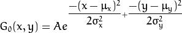
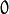

<h1>imageFilter</h1>
<ul>
<li>平滑 也称 模糊, 是一项简单且使用频率很高的图像处理方法。</li>
<li>平滑处理的用途有很多， 但是在本教程中我们仅仅关注它减少噪声的功用 (其他用途在以后的教程中会接触到)。</li>
<li>平滑处理时需要用到一个 滤波器 。 最常用的滤波器是 线性 滤波器，线性滤波处理的输出像素值 (i.e. g(i,j)) 是输入像素值 (i.e. f(i+k,j+l))的加权和 : </li>
</ul>

&emsp;&emsp;&nbsp;h(k,l) 称为 核, 它仅仅是一个加权系数。 &emsp;&emsp;&nbsp;不妨把 滤波器 想象成一个包含加权系数的窗口，当使用这个滤波器平滑处理图像时，就把这个窗口滑过图像。

<ul>
<li>滤波器的种类有很多，这里仅仅提及最常用的:</li>
</ul>

<h2>归一化块滤波器 (Normalized Box Filter)</h2>
<ul>
<li>最简单的滤波器， 输出像素值是核窗口内像素值的 均值 ( 所有像素加权系数相等)</li>
<li>核如下: </li>
</ul>

<h2>高斯滤波器 (Gaussian Filter)</h2>
<ul>
<li>最有用的滤波器 (尽管不是最快的)。 高斯滤波是将输入数组的每一个像素点与 <em>高斯内核</em> 卷积将卷积和当作输出像素值。</li>
<li>一维高斯函数:</li>
</ul>

&emsp;&emsp;&nbsp;假设图像是1维的,那么观察上图，不难发现中间像素的加权系数是最大的， 周边像素的加权系数随着它们远离中间像素的距离增大而逐渐减小。

<ul>
<li>二维高斯函数可以表达为 : </li>
</ul>

&emsp;&emsp;&nbsp;其中  为均值 (峰值对应位置)，代表标准差 (变量  和 变量  各有一个均值，也各有一个标准差)

<h2> 中值滤波器 (Median Filter)</h2>
<ul>
<li>中值滤波将图像的每个像素用邻域 (以当前像素为中心的正方形区域)像素的 <strong>中值</strong> 代替 。</li>
</ul>

<h2>双边滤波 (Bilateral Filter)</h2>
<ul>
<li>目前我们了解的滤波器都是为了平滑图像，问题是有些时候这些滤波器不仅仅削弱了噪声， 连带着把边缘也给磨掉了。为避免这样的情形 (至少在一定程度上), 我们可以使用双边滤波。</li>
<li>类似于高斯滤波器，双边滤波器也给每一个邻域像素分配一个加权系数。 这些加权系数包含两个部分, 第一部分加权方式与高斯滤波一样，第二部分的权重则取决于该邻域像素与当前像素的灰度差值。</li>
<li>详细的解释可以查看 <a class="reference external" href="http://homepages.inf.ed.ac.uk/rbf/CVonline/LOCAL_COPIES/MANDUCHI1/Bilateral_Filtering.html">链接</a></li>
</ul>

<h2>代码解释</h2>
<ol>
<li>归一化块滤波器: OpenCV函数 blur 执行了归一化块平滑操作。
</li>
</ol>
<pre>
<code>
namedWindow(blurImage, WINDOW_NORMAL);
moveWindow(blurImage, 0, 0);
for (int i = 1; i < MAX_KERNEL_LENGTH; i = i + 2)
{
	blur(src, dst, Size(i, i), Point(-1, -1));
	imshow(blurImage, dst);
	waitKey(DELAY_BLUR);
}
destroyWindow(blurImage);
</code>
</pre>
<ul>
<li><em>src</em>: 输入图像</li>
<li><em>dst</em>: 输出图像</li>
<li><em>Size( w,h )</em>: 定义内核大小(  <em>w</em> 像素宽度， <em>h</em> 像素高度)</li>
<li><em>Point(-1, -1)</em>: 指定锚点位置(被平滑点)， 如果是负值，取核的中心为锚点。</li>
</ul>

2. 高斯滤波器: OpenCV函数 GaussianBlur 执行高斯平滑。

<pre>
<code>
namedWindow(GaussianBlurImage, WINDOW_NORMAL);
moveWindow(GaussianBlurImage, 0, 0);
for (int i = 1; i < MAX_KERNEL_LENGTH; i = i + 2)
{
	GaussianBlur(src, dst, Size(i, i), 0, 0);
	imshow(GaussianBlurImage, dst);
	waitKey(DELAY_BLUR);
}
destroyWindow(GaussianBlurImage);
</code>
</pre>
<ul class="simple">
<li><em>src</em>: 输入图像</li>
<li><em>dst</em>: 输出图像</li>
<li><em>Size(w, h)</em>: 定义内核的大小(需要考虑的邻域范围)。   和  必须是正奇数，否则将使用  和  参数来计算内核大小。</li>
<li>:  x 方向标准方差，  如果是  则  使用内核大小计算得到。</li>
<li>:  y 方向标准方差，  如果是  则  使用内核大小计算得到。</li>
</ul>

3. 中值滤波器: OpenCV函数 medianBlur 执行中值滤波操作。

<pre>
<code>
namedWindow(medianBlurImage, WINDOW_NORMAL);
moveWindow(medianBlurImage, 0, 0);
for (int i = 1; i < MAX_KERNEL_LENGTH; i = i + 2)
{
	medianBlur(src, dst, i);
	imshow(medianBlurImage, dst);
	waitKey(DELAY_BLUR);
}
destroyWindow(medianBlurImage);
</code>
</pre>
<ul class="simple">
<li><em>src</em>: 输入图像</li>
<li><em>dst</em>: 输出图像, 必须与 <em>src</em> 相同类型</li>
<li><em>i</em>: 内核大小 (只需一个值，因为我们使用正方形窗口)，必须为奇数。</li>
</ul>

4. 双边滤波器： OpenCV函数 bilateralFilter 执行双边滤波操作。

<pre>
<code>
namedWindow(bilateralFilterImage, WINDOW_NORMAL);
moveWindow(bilateralFilterImage, 0, 0);
for (int i = 1; i < MAX_KERNEL_LENGTH; i = i + 2)
{
	bilateralFilter(src, dst, i, i * 2, i / 2);
	imshow(bilateralFilterImage, dst);
	waitKey(DELAY_BLUR);
}
destroyWindow(bilateralFilterImage);
</code>
</pre>
<ul class="simple">
<li><em>src</em>: 输入图像</li>
<li><em>dst</em>: 输出图像</li>
<li><em>d</em>: 像素的邻域直径</li>
<li>: 颜色空间的标准方差</li>
<li>: 坐标空间的标准方差(像素单位)</li>
</ul>

